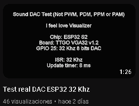

# ESP32wavdac
Play WAV RAW ESP32 direct DAC

<h1>Community</h1>
<ul> 
 <li><b>Youtube: </b><a href='https://www.youtube.com/watch?v=0mmr08lOI1s'>https://www.youtube.com/watch?v=0mmr08lOI1s</a></li>
 <li><b>Forum: </b><a href='https://retrowiki.es/viewtopic.php?f=118&t=200039654#p200173634'>https://retrowiki.es/viewtopic.php?f=118&t=200039654#p200173634</a></li>
</ul>

  
<h1>Details</h1>
<ul> 
 <li>Direct DAC Sound (Not PWM, PDM, PPM or PAM)</li>
 <li>Play WAV in format RAW (8 bits unsigned)</li>
 <li>8, 16, 32 Khz Mono</li>
 <li>GPIO 25 DAC</li>
 <li>TTGO VGA32 v1.x</li>
 <li>Compatible ESP32 board (WEMOS D1 R32, Dev Kit V1, etc...)</li>
 <li>Not PSRAM</li>
 <li>Arduino IDE 1.8.11 Espressif System 1.0.6</li>
 <li>ArduinoDroid (6.3.1)</li>
 <li>Works with Visual Studio 1.66.1 PLATFORMIO 2.4.3 Espressif32 v3.5.0 (python 3.6) but project structure not included</li>
 <li>Test 16000 Hz Mono Sub Urban Cradles NCS Release</li>
 <li>ISR 8, 16 or 32 Khz</li>
 <li>Update routine 8 milliseconds</li>
</ul>

  
<h1>gbConfig.h</h1>
<ul>
 <li><b>use_lib_music_sample_8KHZ:</b> 8 Khz play WAV</li>
 <li><b>use_lib_music_sample_16KHZ:</b> 16 Khz play WAV</li>
 <li><b>use_lib_music_sample_32KHZ:</b> 32 Khz play WAV</li>
</ul>
